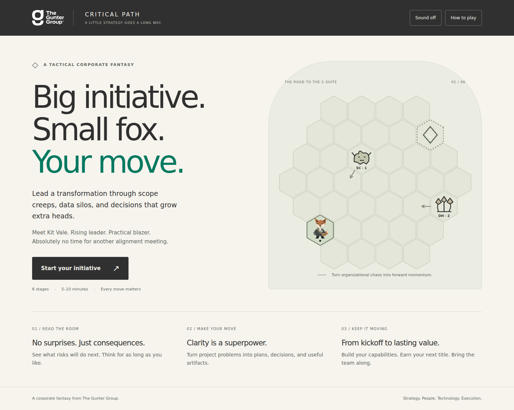

# Critical Path

A short corporate-fantasy tactical roguelite for The Gunter Group. Guide Kit
Vale through six stages of an enterprise transformation, turn project risks
into useful artifacts, and build a leadership result worth sharing.



## Run locally

Requires Node.js 20 or newer. The game has no runtime dependencies.

```sh
git clone https://github.com/dansiger/roguetgg.git
cd roguetgg
npm start
```

Open http://localhost:5173. Use an HTTP server rather than opening `index.html`
as a file, because the source uses ES modules.

```sh
npm test       # Engine regression tests
npm run check  # JavaScript syntax checks
npm run build  # Static deliverable in dist/
node scripts/serve.mjs --dist  # Preview the built game
```

`dist/` is generated and ignored. Deploy its contents to any static host when
ready. All authored source, assets, tests, and documentation live in this repo.
No backend, credentials, account, API key, or external font request is needed.

## Browser checks

```sh
npm ci
npx playwright install chromium
npm run test:browser
```

The browser test starts its own local server and checks a complete campaign,
promotion choices, stall/restart, keyboard controls, result download, and screen
widths from 320 to 1440 pixels. Screenshots go to ignored `test-results/`.
Set `CHROMIUM_PATH` if using an existing Chromium executable. `npm run format`
formats application source and tests.

## Playing

- Click **Start your initiative** to begin immediately.
- Choose **Move / resolve**, then a neighboring hex. An occupied hex receives
  resolution rather than movement. Resolving a risk restores 1 influence.
- Stripes and numbers show the next disruption; arrows show planned movement.
  Each accepted action gives remaining risks one response. Invalid clicks are free.
- Choose a capability and then its highlighted target. Facilitate and Recovery
  plan are immediate actions. Waiting restores influence but also advances risks.
- Walk onto resolved artifacts for another influence point.
- Resolve the stage quota, then reach its Decision Gate. Choose one upgrade;
  restore capacity, refill influence, and continue. The last gate also requires
  resolving the Value Realization Gap.
- Your final result can be downloaded as a PNG, or shared through native file
  sharing if your browser supports it. Unsupported sharing falls back to download.

Keyboard: Tab/Enter throughout; arrows browse the board; Enter/Space acts on
its focused hex; 1–6 select capabilities; W waits; Escape cancels selection.
The field guide describes all controls. Sound starts off.

## Source map

| Path | Purpose |
| --- | --- |
| `src/game.js` | Seeded encounters, turn resolution, progression, result profiles |
| `src/content.js` | Campaign, threats, capabilities, upgrades, contact configuration |
| `src/app.js` | Accessible HTML/SVG interface, input, audio, result PNG export |
| `src/style.css` | Responsive layout and reduced-motion behavior |
| `src/analytics.js` | Local provider-neutral event seam; no network collection |
| `assets/` | Official TGG SVG and original Kit SVG |
| `tests/` | Engine regression tests and a simple simulation player |
| `docs/CONTENT_AND_BRAND.md` | Sources, branding decisions, prototype assumptions |
| `PRODUCT_BRIEF.md` | Product intent and current implementation status |

## Scope and next iteration

This is a first playable prototype, not a public launch. It includes all six
stages, seven threat behaviors, six capabilities, eight possible upgrades,
success/stall endings, result export, keyboard/touch support, optional synthesized
sound, and local analytics events. Gameplay is deterministic after encounter
generation; each new run uses a fresh seed.

There is no persistent account, save/resume, multiplayer, long-term unlock tree,
or installed analytics vendor. Refresh starts over. Public launch and hosting
are separate actions. Final difficulty, pacing, illustration direction, and
marketing copy need hands-on playtesting.

Brand assets belong to The Gunter Group. The official logo is included unchanged
for this project; its source is recorded in the content and brand document.
